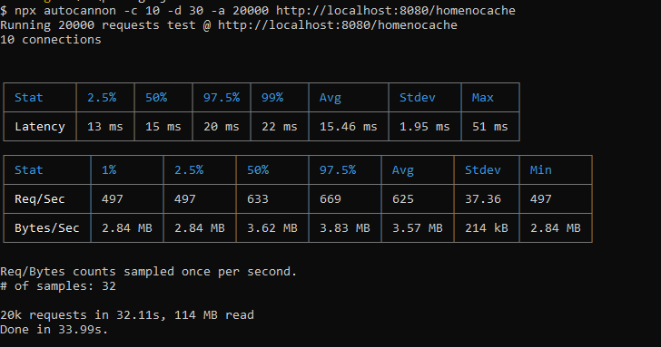
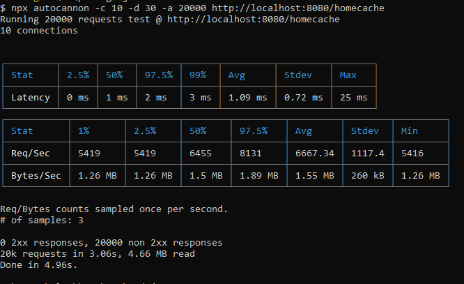

# Cache na prática

Este projeto demonstra o uso de cache para melhorar o desempenho e a eficiência de uma aplicação. O cache é uma técnica amplamente utilizada para armazenar temporariamente dados frequentemente acessados em uma memória de acesso rápido, reduzindo assim o tempo de resposta e minimizando a carga em recursos de backend, como bancos de dados ou serviços externos.

## Realizando requisições em uma API que não utiliza cache:

Teste 20 mil requisições, 10 conexões e duração de 30 segundos:

## Realizando requisições em uma API que utiliza cache:

Teste 20 mil requisições, 10 conexões e duração de 30 segundos:

## Tecnologias Utilizadas

- MySQL, com pool de conexões
- Autocannon, para realizar os testes de carga

## Execução

1. Yarn start,para iniciar o servidor
2. Yarn test:cache10K, para o teste da API que utiliza cache, com 10 mil requisições
3. Yarn test:nocache2K, para o teste da API que não utiliza cache, com 10 mil requisições

## Observações

Um pequeno cache foi criado utilizando eventos (events), feito para fins de demonstração. Para mais informações sobre o funcionamento do cache, acesse a pasta /events.

Número de itens selecionados do banco de dados: 50.
## Conclusão

Com base nos testes realizados, fica evidente a importância do uso de cache para melhorar o desempenho de uma aplicação. Ao compararmos os resultados dos testes entre a API que utiliza cache e a que não utiliza, podemos observar uma grande diferença no tempo de resposta e no consumo de recursos.

No cenário "sem cache":

Latência Média: 15.46 ms
Taxa de Solicitações Média: 625 req/sec
Taxa de Transferência Média: 3.57 MB/sec

No cenário "com cache":
Latência Média: 1.09 ms
Taxa de Solicitações Média: 6667.34 req/sec
Taxa de Transferência Média: 1.55 MB/sec

Esses números revelam que ativar o cache tem um impacto significativamente positivo na experiência do usuário e na capacidade de lidar com cargas de trabalho intensas. No cenário "com cache", observamos uma redução dramática na latência, garantindo respostas rápidas e eficientes. Além disso, a taxa de solicitações é consideravelmente maior no cenário "com cache", evidenciando a capacidade do sistema de lidar com um grande volume de solicitações simultâneas, o que é vital para a estabilidade e a disponibilidade do aplicativo.

Embora haja uma ligeira diminuição na taxa de transferência de dados no cenário "com cache", essa troca é justificável dada a melhoria global no desempenho e a economia de recursos.

Em resumo, a adoção estratégica de um sistema de cache pode ser um elemento fundamental para otimizar a eficiência, escalabilidade e responsividade do seu projeto. Ao aproveitar os benefícios do cache, você não apenas proporciona uma experiência mais ágil e consistente aos usuários, mas também alivia a pressão sobre os recursos do servidor, resultando em um ambiente mais robusto e confiável.

